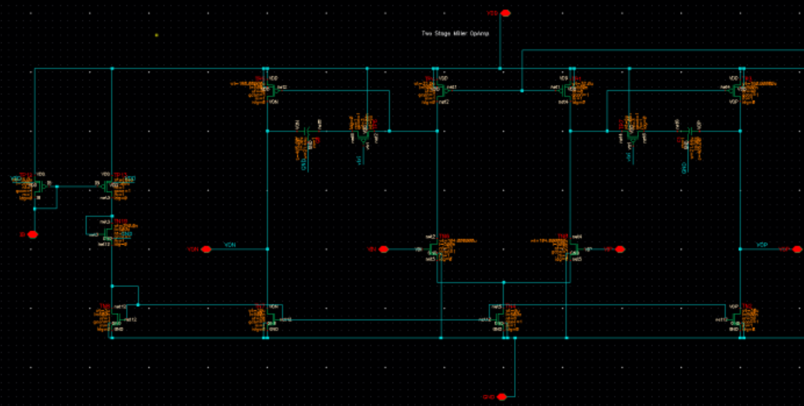
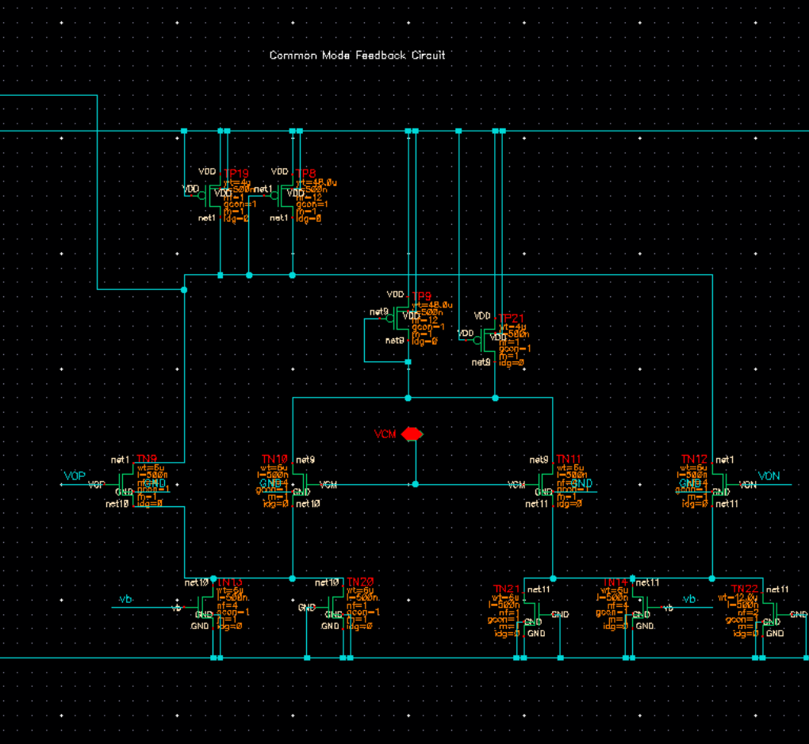
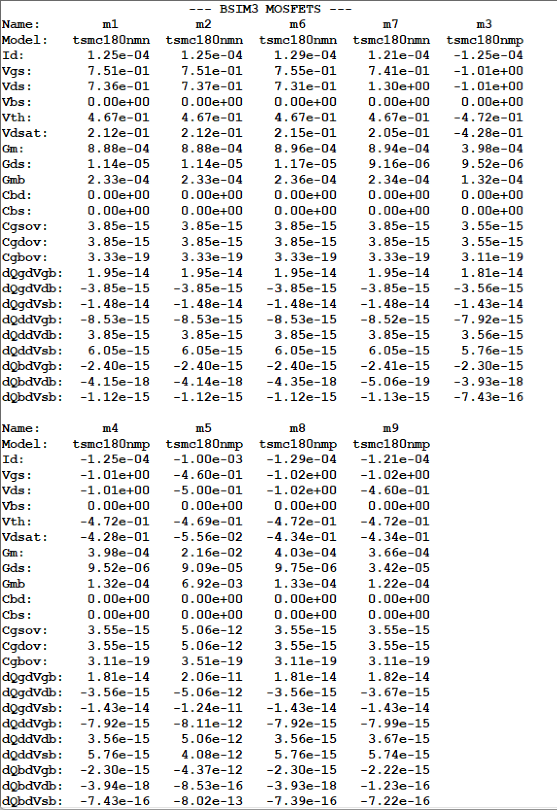
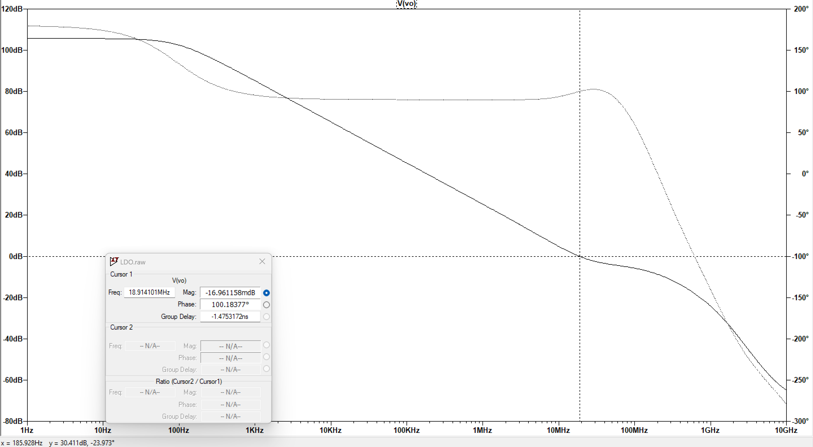
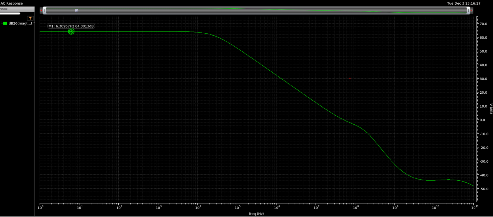
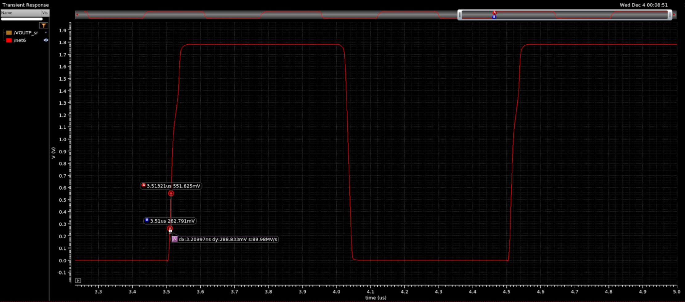
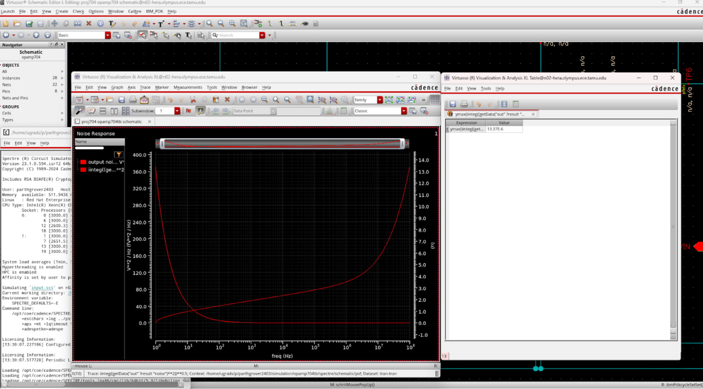
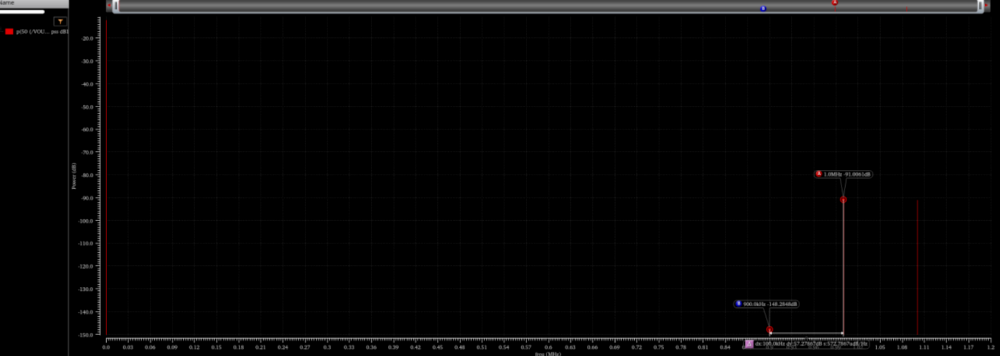
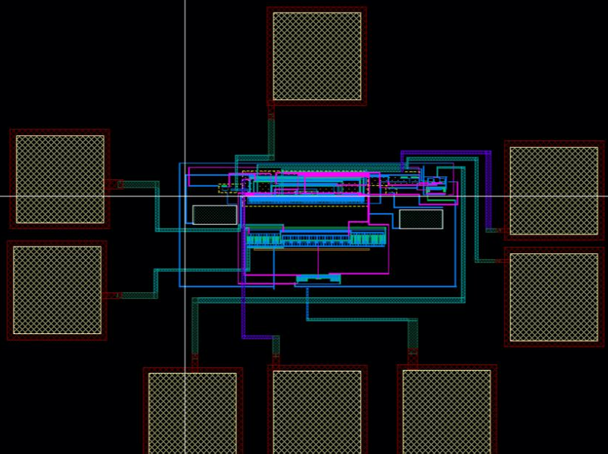

# Design and Compensation of a 1.5V CMOS Low Dropout (LDO) Voltage Regulator

## Project Overview
Designed and simulated a transistor-level 1.5V CMOS Low Dropout (LDO) voltage regulator in LTspice as part of a power management course final project. The regulator was required to maintain stable output regulation across varying load conditions while meeting transient response, load regulation, and low-power standby constraints. The project emphasized analog feedback design, transistor sizing, loop compensation, and stability analysis under different operating conditions.

  

<em>Figure 1: Schematic of the designed LDO.</em>

## Design Specifications

| Parameter | Target |
|--------|--------|
| Output Voltage | 1.5 V |
| Maxiumum Load Current | 100 mA |
| Load Transient Range | 1 mA → 50 mA |
| Maximum Output Voltage Peaking | ≤ 100mV |
| Load Regulation | < 1% |
| Output Load Capacitance (CL) | 100 pF |
| Standby Power Consumption | < 5 mW |
| Supply Voltage (VDD) | 2 V |

---

## Architecture and Design Approach

The LDO was divided into three major functional blocks:

- Two-stage error amplifier
- PMOS pass transistor
- Resistive feedback network

The error amplifier utilized stacked current mirror stages with differential inputs to compare the feedback voltage against a 1V reference source. The PMOS pass device regulated current delivery to the output node while supporting low-dropout operation.

The output voltage was determined using the resistor divider relation:

Vout = Vref (1+Rf2/Rf1)

Using a 1V reference voltage:
- Rf1 = 300 kΩ
- Rf2 = 600 kΩ

This produced a nominal regulated output voltage of approximately 1.5V.

  

<em>Figure 1: Top-level schematic of the two-stage operational amplifier.</em>

  

<em>Figure 2: Common-mode feedback (CMFB) circuit used to regulate output common-mode level.</em>

---

## Key Design Parameters

| Component | Value |
|--------|--------|
| PMOS Pass Transistor | W = 7.11mm, L = 0.4 um |
| Error Amplifier Transistors |	W = 5 µm, L = 0.36 µm |
| Miller Capacitor |	300 pF |
| Miller Resistor |	50 Ω |
| Output Capacitor	| 100 pF |
| ESR Compensation Resistor	| 100 Ω |
| Bias Current Sources | 0.25 mA each |
| Supply Voltage | 2 V |

Insert picture of DC Operating point verification for transistors

  

<em>Figure 2:DC operating point of the transistors showing they all in active region.</em>

---

## Stability and Compensation Strategy
Initial loop gain analysis showed severe instability at light-load conditions, particularly near 1mA load current. The uncompensated loop exhibited negative phase margin behavior, producing oscillatory transient responses.

To stabilize the regulator, two compensation mechanisms were implemented:

Compensation Techniques Used
- ESR zero generated by the output capacitor
- Miller compensation using RC network between amplifier and pass transistor stages
Compensation Goals
- Improve phase margin at light-load conditions
- Reduce transient ringing
- Maintain acceptable bandwidth
- Preserve transient response performance

  

<em>Figure 3: Closed loop gain of the LDO showing Phase Margin and Unity Gain Bandwidth.</em>

After compensation:
- Typical phase margin at nominal load currents: 50°–60°
- Light-load conditions still showed reduced stability margins
- Transient response remained within specification despite degraded edge-case phase margin

  

<em>Figure 5: Post-layout AC response showing DC gain.</em>

  

<em>Figure 6: Transient simulation demonstrating slew rate performance.</em>

  

<em>Figure 7: Input-referred noise integrated from 1 Hz to 100 MHz.</em>

  

<em>Figure 8: IM3 distortion analysis using a 1 Vpp, 1 MHz two-tone input.</em>

---

## Key Engineering Tradeoffs

Stability vs. Transient Response
One of the primary design challenges involved balancing loop stability against transient response speed.

Observations
- Increasing compensation improved stability
- Larger compensation reduced oscillations
- Excessive compensation reduced bandwidth and slowed response

At light-load conditions:
- Pass transistor transconductance decreased
- Output pole shifted
- Phase margin degraded

Despite this, transient response remained well-controlled during load switching events.

  

<em>Figure 9: Final chip layout including pads, op-amp core, and CMFB circuitry.</em>

## Power consumption vs. Loop Gain
The error amplifier bias current was intentionally minimized to satisfy the standby power specification.

Tradeoff Effects
| Lower Bias Current | Result |
|--------|--------|
| Reduced power dissipation | Improved efficiency |
| Reduced amplifier gain |	Lower loop gain |
| Reduced bandwidth |	Weaker regulation/stability margins |

Final standby power consumption:
- Approximately 1mW
- Well below the required 5mW

## Pass Transistor Sizing Tradeoffs
The PMOS pass transistor sizing strongly impacted:
- Current drive capability
- Transient response
- Stability behavior
- Parasitic capacitance

Design Insights
- Larger width improved load drive capability
- Larger device parasitics complicated compensation
- Smaller channel length reduced transient peaking
- Light-load stability became more difficult with aggressive sizing

## Simulation Results
### Load Regulation Performance
The regulator maintained nearly constant output voltage across the full load current range.

| Load Current | Output Voltage |
|--------|--------|
| 1 mA | 1.4999 V |
| 100 mA |	1.4995 V |

Calculate Load Regulation:
0.013%

This significantly exceeded the required specification of less than 1%.
insert picture for the load regulation.

### Transient Response
Transient simulations were performed using a pulsed current source switching between:
- 1mA
- 50mA

with:
- 1µs rise time
- 1µs fall time

Measured Results
| Metric | Measured Value |
|--------|--------|
| Overshoot | -11 mV |
| Undershoot |	~30 mV |
| Peak-to-Peak Variation | ~41.5 mV |
| Specification | <100 mV |

The regulator comfortably met the transient peaking requirement.

Insert Figure: “Transient Response During 1mA to 50mA Load Switching”

### Line Regulation Analysis
The input supply voltage was swept to obtain simulations to evaluate line regulation performance.

Line Regulation Results
| VDD (V) | Vout (V) |
|--------|--------|
| 1.7 | 1.4876 |
| 1.8 | 1.4923 |
| 1.9 | 1.4963 |
| 2.0 | 1.5 |
| 2.1 | 1.5035 |
| 2.2 | 1.5068 |
| 2.3 | 1.51 |
INSERT TABLE FOR THIS DATA HERE

Calculated line regulation:
- Approximately 18.7 mV/V

Key Insight
The regulator maintained relatively stable output voltage despite varying supply conditions. The remaining variation was primarily caused by:
- Finite error amplifier gain
- Limited loop gain
- Reduced voltage headroom across the pass transistor

Insert Figure: “Line Regulation Sweep: Output Voltage vs. Input Supply Voltage”

## Key Takeaways and Future Improvements
### Lessons Learned
This project demonstrated how strongly LDO stability depends on load current due to changes in pass transistor transconductance and output pole location. It also highlighted the difficulty of simultaneously optimizing:
- Stability
- Bandwidth
- Transient response
- Low standby power

A major takeaway was understanding how compensation placement directly impacts both transient behavior and loop stability under different operating conditions.

### Future Improvements
- Higher-gain error amplifier design
- Adaptive biasing for improved light-load stability
- Improved compensation optimization
- PSRR characterization and optimization
