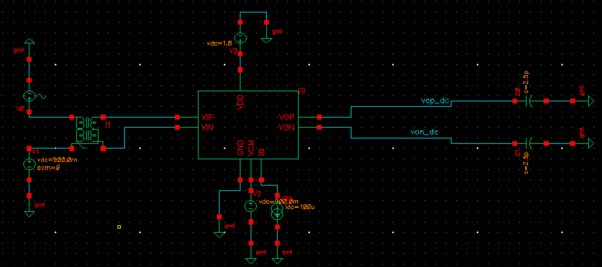
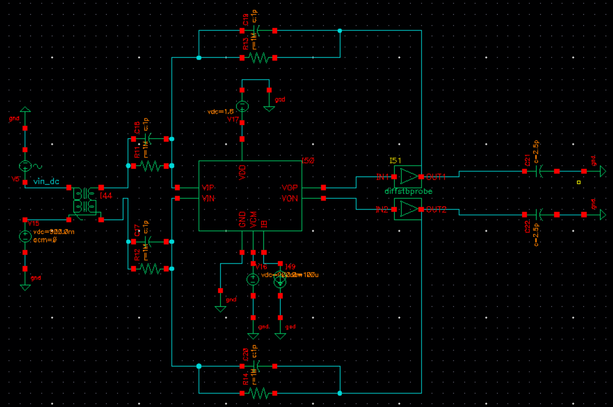

# Design and Compensation of a 1.5V CMOS Low Dropout (LDO) Voltage Regulator

## Project Overview
Designed and simulated a transistor-level 1.5V CMOS Low Dropout (LDO) voltage regulator in LTspice as part of a power management course final project. The regulator was required to maintain stable output regulation across varying load conditions while meeting transient response, load regulation, and low-power standby constraints. The project emphasized analog feedback design, transistor sizing, loop compensation, and stability analysis under different operating conditions.

Picture here for the LDO

## Design Specifications

| Parameter | Target |
|--------|--------|
| Output Voltage | 1.5 V |
| Maxiumum Load Current | 100 mA |
| Load Transient Range | 1 mA → 50 mA |
| Maximum Output Voltage Peaking | ≤ 100mV |
| Load Regulation | < 1% |
| Output Load Capacitance (CL) | 100 pF |
| Standby Power Consumption | < 5 mW |
| Supply Voltage (VDD) | 2 V |

---

## Architecture and Design Approach

The LDO was divided into three major functional blocks:

- Two-stage error amplifier
- PMOS pass transistor
- Resistive feedback network

The error amplifier utilized stacked current mirror stages with differential inputs to compare the feedback voltage against a 1V reference source. The PMOS pass device regulated current delivery to the output node while supporting low-dropout operation.

The output voltage was determined using the resistor divider relation:

Vout = Vref (1+Rf2/Rf1)

Using a 1V reference voltage:
- Rf1 = 300 kΩ
- Rf2 = 600 kΩ

This produced a nominal regulated output voltage of approximately 1.5V.

pictures for dc operating point, loop gain before comp, loop gain after comp

  

<em>Figure 1: Top-level schematic of the two-stage operational amplifier.</em>

  

<em>Figure 2: Common-mode feedback (CMFB) circuit used to regulate output common-mode level.</em>

---

## Key Design Parameters

| Component | Value |
|--------|--------|
| PMOS Pass Transistor | W = 7.11mm, L = 0.4 um |
| Error Amplifier Transistors |	W = 5 µm, L = 0.36 µm |
| Miller Capacitor |	300 pF |
| Miller Resistor |	50 Ω |
| Output Capacitor	| 100 pF |
| ESR Compensation Resistor	| 100 Ω |
| Bias Current Sources | 0.25 mA each |
| Supply Voltage | 2 V |

Insert picture of DC Operating point verification for transistors

  

<em>Figure 3: Open-loop simulation testbench configuration.</em>

  

<em>Figure 4: Closed-loop simulation testbench configuration.</em>

---

## Stability and Compensation Strategy
Initial loop gain analysis showed severe instability at light-load conditions, particularly near 1mA load current. The uncompensated loop exhibited negative phase margin behavior, producing oscillatory transient responses.

To stabilize the regulator, two compensation mechanisms were implemented:

Compensation Techniques Used
- ESR zero generated by the output capacitor
- Miller compensation using RC network between amplifier and pass transistor stages
Compensation Goals
- Improve phase margin at light-load conditions
- Reduce transient ringing
- Maintain acceptable bandwidth
- Preserve transient response performance

insert pictures of loop gain before and after compensation

After compensation:
- Typical phase margin at nominal load currents: 50°–60°
- Light-load conditions still showed reduced stability margins
- Transient response remained within specification despite degraded edge-case phase margin

  

<em>Figure 5: Post-layout AC response showing DC gain.</em>

  

<em>Figure 6: Transient simulation demonstrating slew rate performance.</em>

  

<em>Figure 7: Input-referred noise integrated from 1 Hz to 100 MHz.</em>

  

<em>Figure 8: IM3 distortion analysis using a 1 Vpp, 1 MHz two-tone input.</em>

---

## Key Engineering Tradeoffs

Stability vs. Transient Response
One of the primary design challenges involved balancing loop stability against transient response speed.

Observations
- Increasing compensation improved stability
- Larger compensation reduced oscillations
- Excessive compensation reduced bandwidth and slowed response

At light-load conditions:
- Pass transistor transconductance decreased
- Output pole shifted
- Phase margin degraded

Despite this, transient response remained well-controlled during load switching events.

  

<em>Figure 9: Final chip layout including pads, op-amp core, and CMFB circuitry.</em>

### Post-Layout Performance Summary

| Metric | Achieved |
|------|---------|
| DC Gain | 64.03 dB |
| Power Dissipation | 1.298 mW |
| GBW | 139 MHz |
| Slew Rate | 89.98 V/µs |
| Input-Referred Noise | 13.37 µV RMS |
| IM3 | −59.8 dB |
| Differential Phase Margin | 63° |
| CMFB Phase Margin | 68.25° |

All specifications were met after parasitic extraction.

---

## Key Learnings
- Tradeoffs between gain, bandwidth, and power in multi-stage amplifiers
- Importance of compensation strategy for closed-loop stability
- Impact of parasitic extraction on analog performance
- Noise-aware input stage selection and biasing

