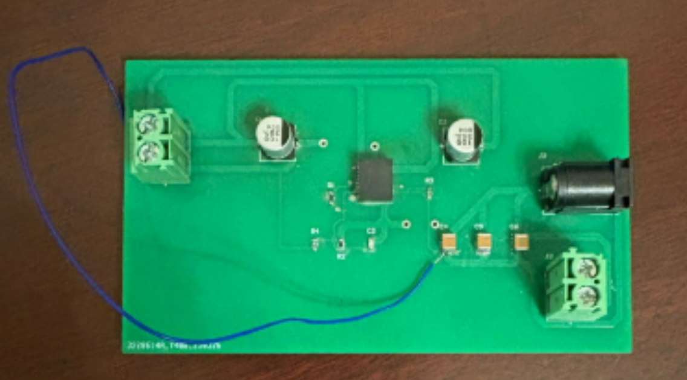
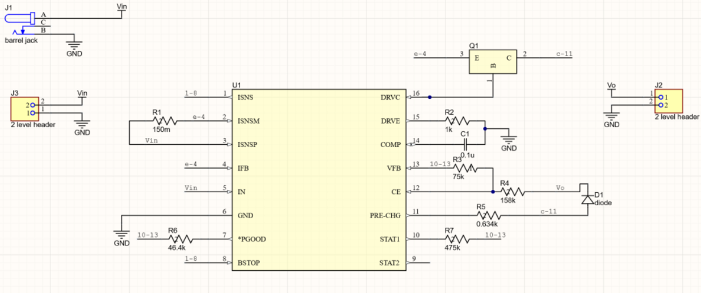
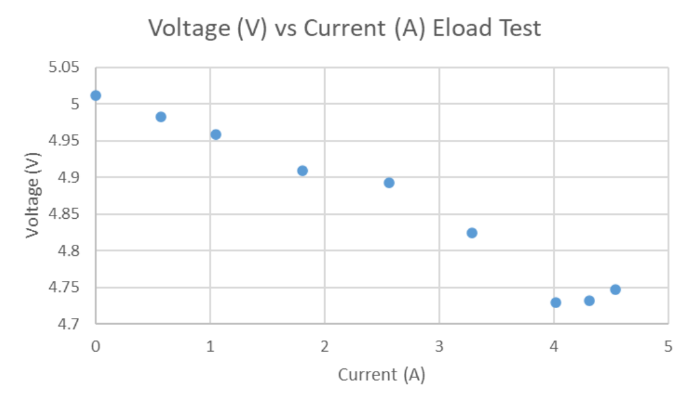
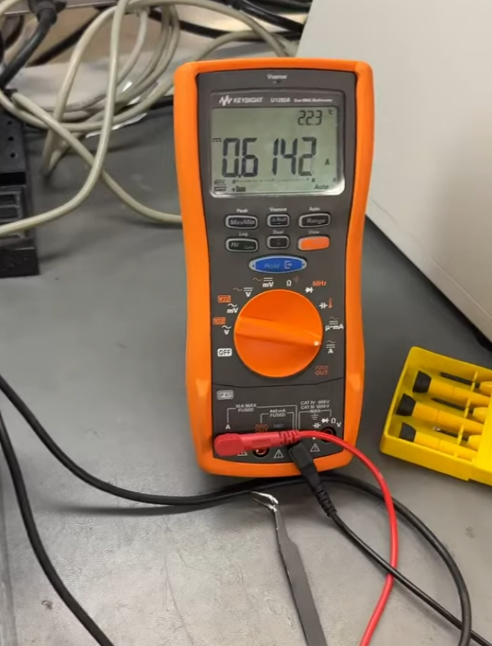
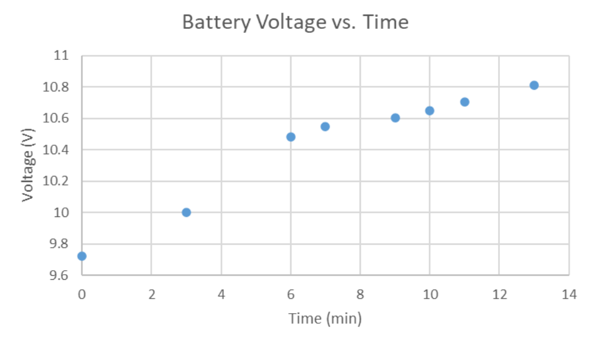

# Capstone: DC-DC Buck Converter & Battery Charging System

## Overview
Designed and implemented the power management subsystem for an autonomous robot,
including DC-DC conversion, battery charging, and power monitoring to support
embedded compute and motor loads.

## Problem Statement
The system required stable power delivery from lead-acid batteries to multiple
subsystems with different voltage and current requirements, while ensuring safe
charging, monitoring, and protection.

## My Role
- Power system architecture
- DC-DC regulator selection and design
- Battery charging circuit design
- Current and voltage monitoring
- Validation and testing

## Technical Details
- Battery configuration: 2 × 12V 18 Ah lead-acid batteries (series)
- DC-DC converter: TLVM13610 IC (5V, 4A) for embedded compute and sensors
- Battery charger: BQ24450-based constant voltage / current-limited design
- Float charging voltage: 13.6–13.8V
- Maximum system current: < 3A

## Design Considerations
- Thermal dissipation in linear charging stages
- Efficiency tradeoffs between linear and switching regulation
- Load transients from motors and compute modules
- Protection against overcurrent and reverse polarity

## Validation & Results
- Verified regulated output voltage stability under varying loads
- Confirmed safe charging current limits for battery health
- Evaluated current sense accuracy during dynamic load conditions

## Lessons Learned
- Importance of regulator efficiency in battery-powered systems
- Impact of component selection on thermal performance
- Practical challenges of power integrity in mixed-load systems

## Evidence & Documentation

### PCB and Hardware

### Schematic

### Measurements

### System Demonstration
- [Buck Converter PCB Powering Jetson Nano – YouTube](https://www.youtube.com/shorts/Y9bEtNm3nqs)
- [Battery Charging PCB Drawing Current – YouTube](https://youtube.com/shorts/oKZRPvmx3F4?feature=share)
- [Battery Charging PCB Charging Lead-Acid Battery – YouTube](https://youtube.com/shorts/u5XXYdZQjoI?feature=share)

