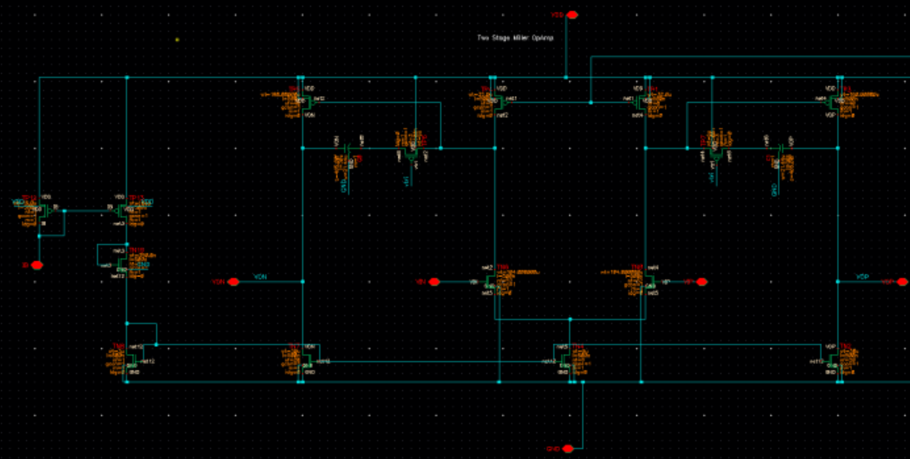
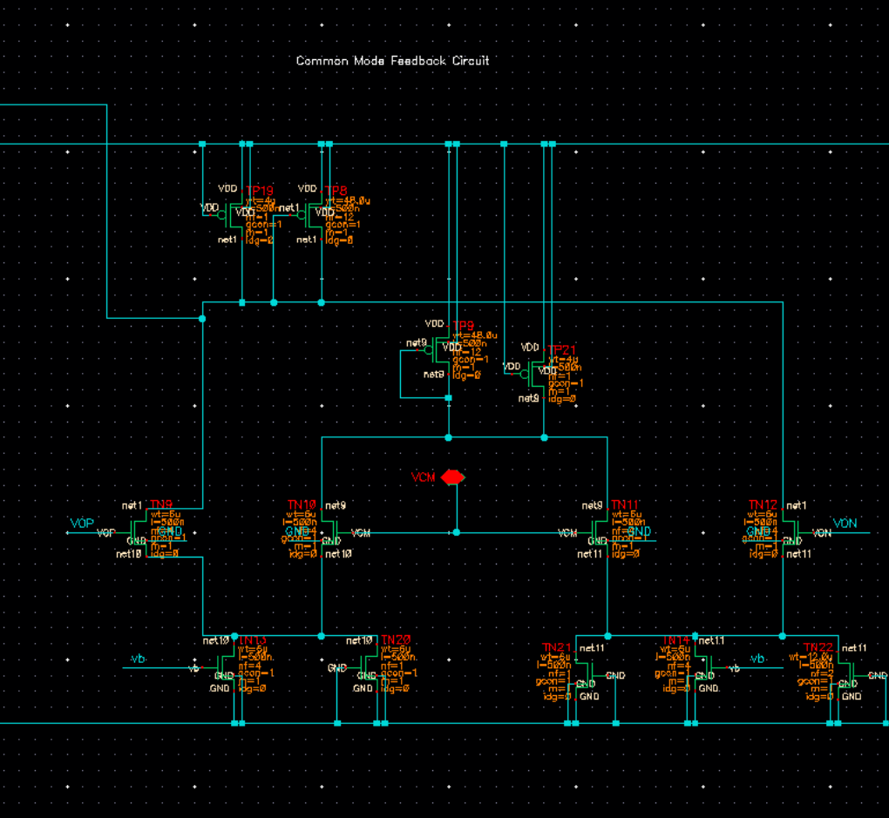
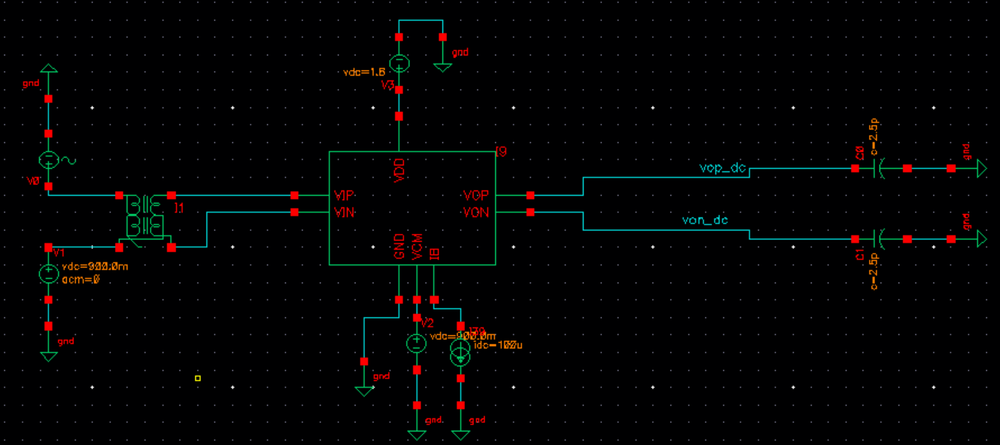
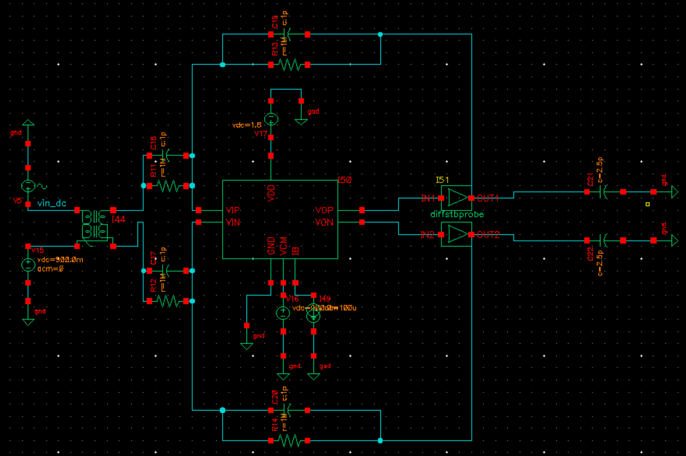
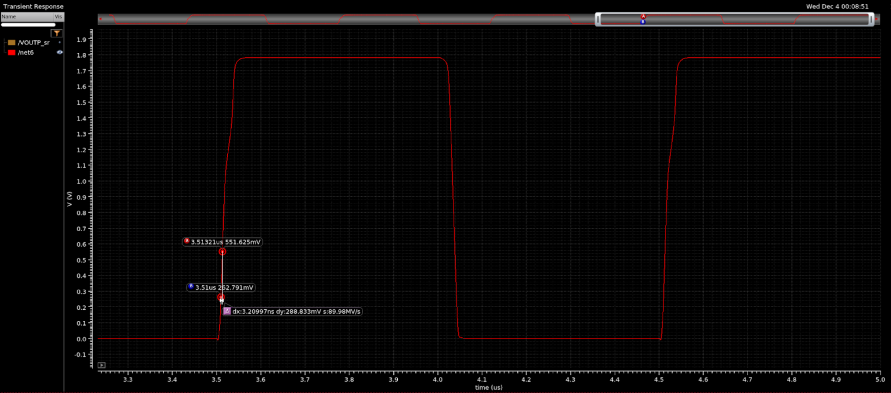
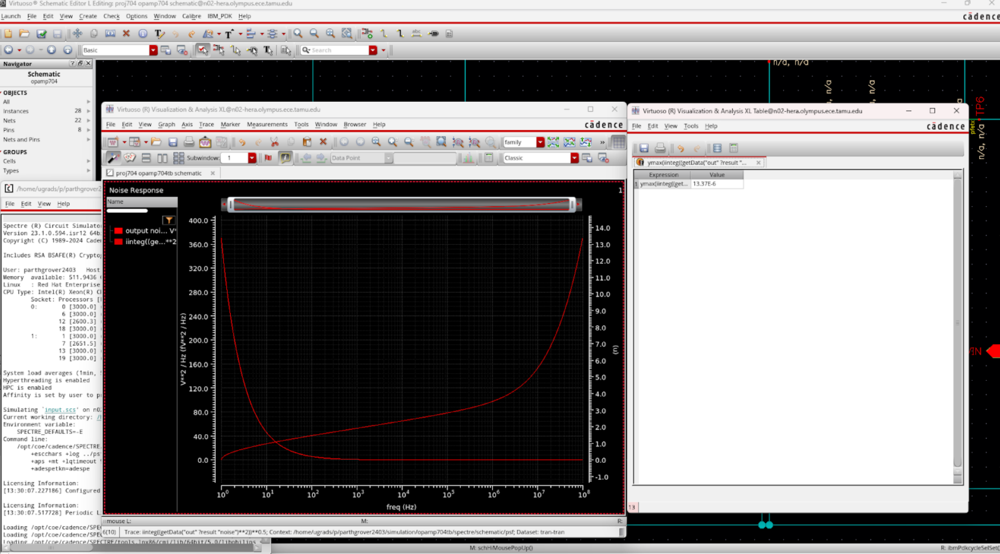
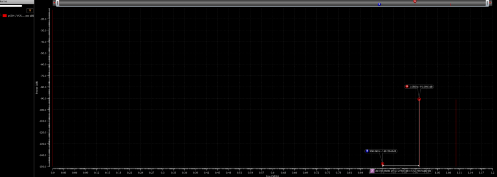
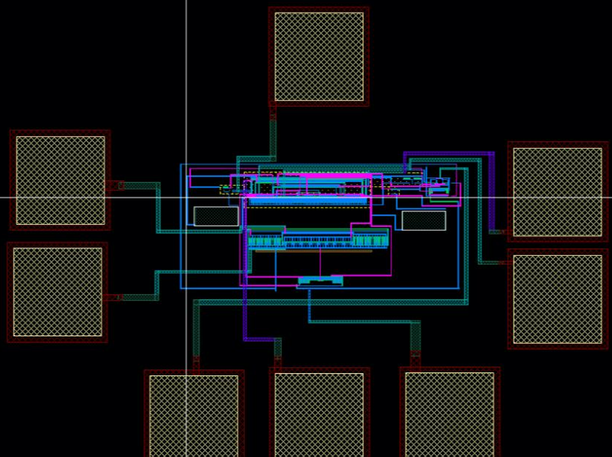

# Analog IC Design: Two-Stage Miller-Compensated Operational Amplifier (180 nm)

## Overview
Designed, laid out, and verified a two-stage operational amplifier using the
IBM 180 nm CMOS process as an individual course project. The full analog IC
design flow was followed, including schematic design, layout, parasitic
extraction, and post-layout simulations to meet stringent open-loop and
closed-loop performance specifications.

All simulations and layout were performed using Cadence Virtuoso.

---

## Design Specifications

| Parameter | Target |
|--------|--------|
| Supply Voltage | 1.8 V |
| Common-Mode Level | 0.9 V |
| Chip Area (incl. pads) | 1 mm × 1 mm |
| Power Dissipation | ≤ 3 mW (Open-loop) |
| DC Gain | > 60 dB (Open-loop) |
| GBW | ≥ 120 MHz (Open-loop) |
| Slew Rate | ≥ 75 V/µs |
| Input-Referred Noise (1 Hz–100 MHz) | ≤ 50 µV RMS |
| IM3 (1 Vpp @ 1 MHz) | ≤ −60 dB (Closed-loop) |
| Differential Phase Margin | ≥ 60° |
| CMFB Phase Margin | ≥ 60° |

---

## Architecture & Circuit Design

- **Input Stage:** PMOS differential pair selected to meet stringent
  input-referred noise requirements
- **Second Stage:** Common-source amplifier for high gain
- **Biasing:** Current mirror-based bias network
- **Common-Mode Feedback (CMFB):** Dedicated CMFB loop to regulate output common-mode voltage
- **Testbenches:** Custom open-loop and closed-loop testbenches developed for
  gain, stability, noise, and distortion verification

  

<em>Figure 1: Top-level schematic of the two-stage operational amplifier.</em>

  

<em>Figure 2: Common-mode feedback (CMFB) circuit used to regulate output common-mode level.</em>

---

## Compensation & Stability

- Miller compensation capacitor used between the first and second stages
- Triode-region transistor employed as a nulling element for pole-zero placement
- Compensation designed to remain stable across PVT variations
- Both differential-mode and CMFB loops independently verified for stability

  

<em>Figure 3: Open-loop simulation testbench configuration.</em>

  

<em>Figure 4: Closed-loop simulation testbench configuration.</em>

---

## Simulation & Verification

  

<em>Post-layout AC response showing DC gain and unity-gain bandwidth.</em>

  

<em>Transient simulation demonstrating slew rate performance.</em>

  

<em>Input-referred noise integrated from 1 Hz to 100 MHz.</em>

  

<em>IM3 distortion analysis using a 1 Vpp, 1 MHz two-tone input.</em>

---

## Layout & Post-Layout Results

  

<em>Final chip layout including pads, op-amp core, and CMFB circuitry.</em>

### Post-Layout Performance Summary

| Metric | Achieved |
|------|---------|
| DC Gain | 64.03 dB |
| Power Dissipation | 1.298 mW |
| GBW | 139 MHz |
| Slew Rate | 89.98 V/µs |
| Input-Referred Noise | 13.37 µV RMS |
| IM3 | −59.8 dB |
| Differential Phase Margin | 63° |
| CMFB Phase Margin | 68.25° |

All specifications were met after parasitic extraction.

---

## Key Learnings
- Tradeoffs between gain, bandwidth, and power in multi-stage amplifiers
- Importance of compensation strategy for closed-loop stability
- Impact of parasitic extraction on analog performance
- Noise-aware input stage selection and biasing
- Practical challenges of full-chip layout and verification

