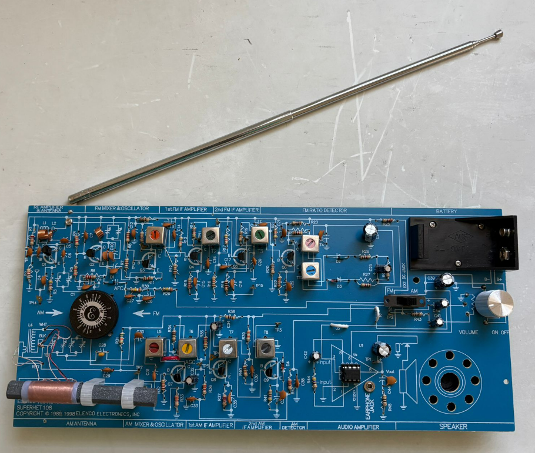

# RF Systems: Superhetrodyne Radio Receiver

## Overview
Designed, assembled, aligned, and characterized a dual-band AM/FM
superheterodyne radio receiver using the Elenco 108CK platform. This project
focused on understanding and verifying core RF system principles including
frequency conversion, intermediate-frequency (IF) processing, analog feedback
control loops, and audio amplification.

The receiver employs heterodyning to translate incoming RF signals to fixed
intermediate frequencies (455 kHz for AM and 10.7 MHz for FM) allowing high
selectivity and stable gain using fixed-tuned IF stages. Performance was
validated through alignment procedures and dynamic measurements.

---

## System Architecture

- Superheterodyne receiver topology
- RF input → mixer → IF amplification → demodulation → audio amplification
- Fixed IF operation:
  - AM IF: 455 kHz
  - FM IF: 10.7 MHz
- Local oscillator tracking maintained across the tuning range

---

## AM Receiver Design & Analysis
- Implemented Automatic Gain Control (AGC) to stabilize audio output under
varying signal strengths
- AGC feedback reduces IF amplifier gain by increasing effective emitter
resistance as signal amplitude increases
- Prevents distortion and saturation in strong-signal conditions

## Measured Performance
- AM IF transformers function as a bandpass filter
- Verified approximately 6 kHz 3-dB bandwidth, consistent with AM broadcast
audio requirements

---

## FM Receiver Design & Analysis
- Implemented FM demodulation using a ratio detector
  - Recovers audio from frequency deviation rather than amplitude variation
  - Provides inherent noise immunity and limiting behavior
- Integrated Automatic Frequency Control (AFC) to correct local oscillator drift
  - Uses a varactor diode whose capacitance varies with control voltage
  - Compensates for temperature and supply-induced frequency shifts

---

## Audio Amplification
Designed and evaluated two Class-AB audio amplification stages:

| Amplifier Type | Description |
|--------|--------|
| LM386 IC | Compact integrated audio amplifier |
| Discrete | Five-transistor Class AB amplifier |

Class-AB operation was selected to balance efficiency and signal fidelity,
providing high theoretical efficiency while eliminating crossover distortion
through controlled biasing.

---

## RF Alignment & Tracking
- Performed receiver alignment using a dual-material tuning tool:
  - Brass tip to decrease inductance
  - Iron tip to increase inductance

- Ensured accurate oscillator tracking:
  - Inductor adjustment at the low end of the tuning range
  - Trimmer capacitor adjustment at the high end

- Maintained local oscillator frequency exactly one IF above the tuned station
across the entire dial

---

  

<em>Figure 1: Fully assembled Elenco 108CK AM/FM superhetrodyne receiver.</em>

---

## Tools & Techniques

- Through-hole soldering and hardware debugging
- RF alignment and tuning
- Frequency-domain signal analysis
- Analog feedback control (AGC, AFC)
- Bandpass filter characterization
- AM and FM demodulation principles

---

## Key Takeaways

- Practical implementation of superheterodyne receiver theory
- Hands-on experience with RF signal chains and analog control loops
- Insight into real-world non-idealities such as drift, noise, and component
tolerance
- Strong foundation for RF, mixed-signal, test, and hardware validation roles
