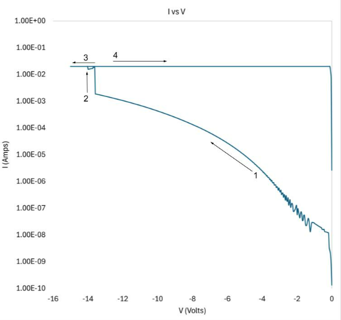
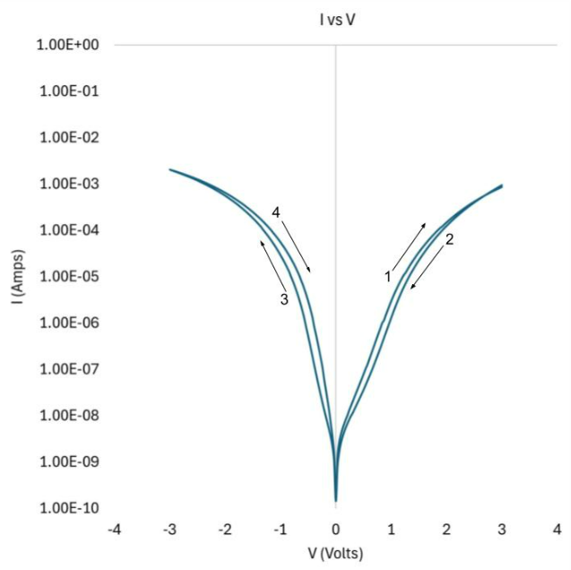
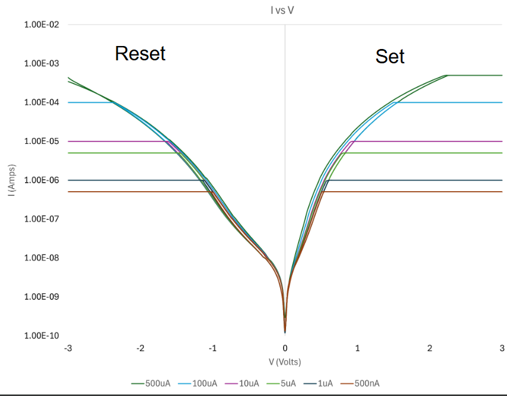

# Samsung Austin Semiconductor Fellowship: Memristor Characterization & NAND Flash Test Hardware

## Overview
Worked on characterization and test infrastructure development for emerging
memory technologies as part of the Samsung Austin Semiconductor Fellowship program. The project
spanned two semesters, progressing from device-level memristor characterization
to custom PCB development for parameter extraction from commercial 3D NAND
flash devices.

---

## Semester 1: Memristor Device Characterization

### Objective
To experimentally characterize memristor devices fabricated by the research
team, focusing on electroforming, resistive switching behavior, and control of
switching dynamics.

### Experimental Setup
- Optical inspection using Sanjscope microscope
- Electrical probing via probe station
- Measurements performed using Keysight B1500A Semiconductor Device Analyzer
- Direct probing of on-chip pads on memristor test structures

  

<em>Figure 1: Optical image of the memristor device under test.</em>

  

<em>Figure 2: Probe station setup used for electrical characterization.</em>

---

### Measurements & Results

  

<em>Figure 3: Electroforming behavior observed during initial device activation.</em>

  

<em>Figure 4: Bipolar resistive switching behavior after successful electroforming.</em>

  

<em>Figure 5: Controlled modulation of switching behavior using different compliance currents.</em>

---

### Key Outcomes
- Successfully electroformed memristor devices
- Demonstrated repeatable resistive switching behavior
- Established control over switching magnitude via compliance current tuning
- Gained hands-on experience with semiconductor device characterization tools

---

## Semester 2: 3D NAND Flash Parameter Extraction PCB

### Objective
To design and implement a custom testbench PCB capable of interfacing with and
extracting electrical parameters from a Micron 3D NAND Flash device.

### Testbench Architecture
- NAND Flash housed in a BGA-132 socket
- FTDI FT2232 board used for USB-to-serial communication with host computer
- Two TXB0108 level shifters for 3.3V to 1.2V signal translation
- On-board DC-DC regulator converting 5V to 1.2V for NAND core supply
- Pull-up and pull-down resistors for signal conditioning

---

### PCB Design & Iteration
The PCB design underwent two iterations to address signal integrity and
interface reliability challenges identified during bring-up.

  

<em>Figure 1: Final schematic of the NAND Flash testbench PCB.</em>

  

<em>Figure 2: Final PCB layout implementing the NAND Flash test interface.</em>

---

### Final Implementation
The final board successfully interfaced with the NAND Flash device and enabled
parameter extraction through the custom test setup.

  

<em>Figure 3: Assembled NAND Flash testbench PCB.</em>

---

### Key Outcomes
- Designed a functional testbench PCB for advanced memory devices
- Gained experience interfacing with high-density NAND Flash packages
- Learned practical challenges of voltage level translation and PCB iteration
- Developed hardware to support silicon-level characterization

